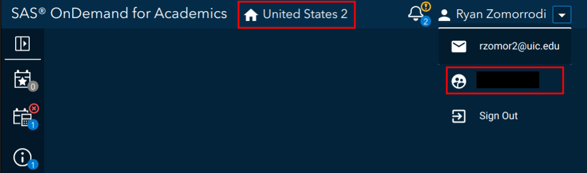
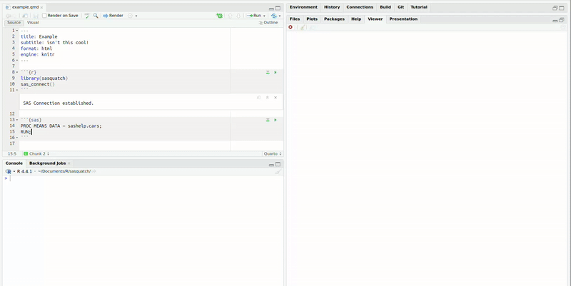
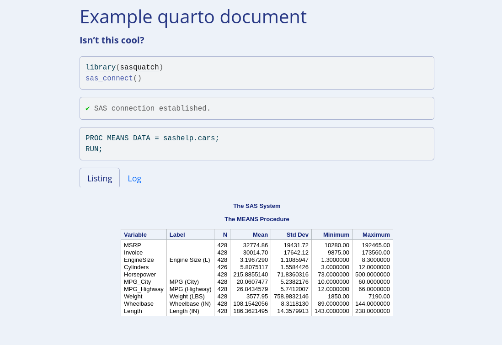

<!-- README.md is generated from README.Rmd. Please edit that file -->

```{r, include = FALSE}
knitr::opts_chunk$set(
  collapse = TRUE,
  comment = "#>",
  fig.path = "man/figures/README-",
  out.width = "100%"
)
```

# sasquatch

<!-- badges: start -->
[](https://github.com/ryanzomorrodi/sasquatch/actions/workflows/R-CMD-check.yaml)
[](https://app.codecov.io/gh/ryanzomorrodi/sasquatch?branch=main)
<!-- badges: end -->

Use SAS, R, and Quarto Together

`sasquatch` allows you to combine the power of R, SAS, and quarto together
to create reproducible multilingual reports. `sasquatch` can: 

* Run SAS code blocks interactively
* Send data back and forth between SAS and R
* Conduct basic file management on a SAS client
* Render SAS output within quarto documents.

`sasquatch` relies on the [`SASPy`](https://sassoftware.github.io/saspy/) Python
package and the `reticulate` R package to interoperate with Python. Check out 
`vignette("configuration")` for guidance on `SASPy` configuration.

### Comparison with similar packages

[`sasr`](https://CRAN.R-project.org/package=sasr)

* `sasr` works identically to `sasquatch` relying on the `SASPy` Python package
to interface with SAS, but does not include any interactive, file management, 
or quarto functionality. 

[`configSAS`](https://github.com/baselr/configSAS)

* Like `sasr` and `sasquatch`, `configSAS` relies on the `SASPy` Python package,
but it primarily focuses on solely on `knitr` engine support.
* The `configSAS` engine HTML output CSS styles interfere with the rest of the
document and SAS code output is not contained within a code block.

[`SASmarkdown`](https://CRAN.R-project.org/package=SASmarkdown)

* `SASmarkdown` does not rely on the `SASPy` Python package and thus is fairly
simple to set up; however, it does require a SAS executable to be installed on
the same machine as R. 
* In contrast, `SASPy`-reliant packages can interface with both local and remote
SAS installations and can easily pass data between R and SAS without the need
for intermediate files.
* `SASmarkdown` features several different engines for various formats not 
currently implemented within `sasquatch` like latex pdfs or non-HTML5 HTML.

`sasquatch` may be beneficial to you if you...  

* Rely on remote SAS client  
* Desire interactive SAS functionality while developing  
* Require remote SAS file management  
* Would like to be able to easily send data back and forth between SAS and R   
without the use of intermediate files  

If you require pdf `knitr` support and have a local installation of SAS, I would
recommend using `SASmarkdown`at this time.

## Installation

### Package installation

You can install the development version of sasquatch like so:

```{r eval = FALSE}
# install.packages("pak")
pak::pkg_install("ryanzomorrodi/sasquatch")
```

### Python installation

Make sure Python is installed on your system. If Python has not been installed,
you can install Python like so:

```{r, eval = FALSE}
reticulate::install_python()
```

or download the installer from the [Python Software Foundation](https://www.python.org/downloads/').

### `SASPy` installation

To install the `SASPy` package and its dependencies within a Python virutal
environment:

```{r, eval = FALSE}
sasquatch::install_saspy()
```

### Configuration

Configuration for SAS can vary greatly based on your computer's operating system and the SAS platform you wish to connect to. For more information check out `vignette("configuration")`.

**Don't have a SAS license currently or just want to get set up quickly?** Configure `sasquatch` for SAS On Demand for Academics using the steps below:

#### Registration

SAS On Demand for Academics (ODA) is free SAS client for professors, students, and independent learners. Create an account at <https://welcome.oda.sas.com/>.

Once you have set up your account, log in and note the ODA server (in the picture below United States 2) and your username (under the email in the profile dropdown). We will need these for later.



#### Java installation

ODA relies on the IOM access method, which requires Java. Make sure Java is installed on your system. You can download Java from [their website](https://www.java.com/en/download/). Note the Java installation path.

#### ODA Configuration

Set up for ODA is super easy. Run `config_saspy()` and follow the prompts (you may need to recall your username, server, and java installation path from earlier).

```{r, eval = FALSE}
sasquatch::configure_saspy(template = "oda")
```

`config_saspy(template = "oda")` will create a `sascfg_personal.py` file with all the relevant configuration information and create an `authinfo` file, which will store your ODA credentials. More information about ODA configuration can be found in the [ODA section of `SASPy` configuration documentation](https://sassoftware.github.io/saspy/configuration.html#iom).

## Usage

Once you have setup `SASPy` and connected to the right python
environment using `reticulate` (if necessary), you can create a quarto document
like any other, call `sas_connect()`, and just get going!

`````{verbatim}
---
format: html
engine: knitr
---

```{r}
library(sasquatch)
sas_connect()
```

```{sas}

```
`````

### Code blocks

Now, you should be able to run SAS code blocks in RStudio like any other.


### Sending output to viewer

If you want to send the SAS output to the viewer, you can utilize the 
`sas_run_selected()` addin with a custom shortcut.



### Converting tables

Pass tables between R and SAS with `sas_from_r()` and `sas_to_r()`.

```{r, eval = FALSE}
sas_from_r(mtcars, "mtcars")
cars <- sas_to_r("cars", libref = "sashelp")
```

### Rendering quarto documents

And of course, render beautiful quarto documents in the same style you would
expect from SAS with the `sas_engine()`.


