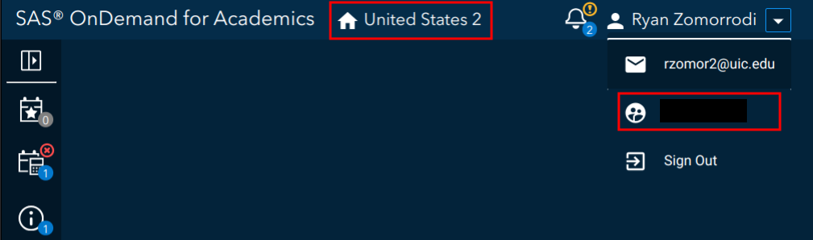

```{r, include = FALSE}
knitr::opts_chunk$set(
  collapse = TRUE,
  comment = "#>"
)
```

## General configuration

`sasquatch` works by utilizing the [`SASPy`](https://sassoftware.github.io/saspy/) python package, similar to packages like [`sasr`](https://github.com/insightsengineering/sasr) or [configSAS](https://github.com/baselr/configSAS). This means everything we do to connect R and SAS, needs to go through `SASPy`.

Configuration steps for `SASPy` can vary greatly depending on the SAS client, but all configuration is specified within the `sascfg_personal.py` file inside of the `SASPy` package.

### Setting up

Use the following function to create a `sascfg_personal.py` templated file.

```{r, eval = FALSE}
sasquatch::configure_saspy()
```

**Note**: `sasquatch::configure_saspy()` will configure `reticulate`'s current python version. You may have to run `reticulate::use_virtualenv("r-saspy")` in order to specify that you want to configure that python environment.

This will create a file like the following:

```{python, eval = FALSE}
SAS_config_names = ['config_name']

config_name = {
	
}
```

`SAS_config_names` should contain a string list of the variable names of all configurations. Configurations are specified as dictionaries, and configuration parameters depend on the access method.

Additionally, some access methods will require an additional authentication file (`.authinfo` for Linux and Mac, `_authinfo` for Windows) stored in the user's home directory, which are constructed as follows:

```
config_name user {your username} password {your password}
```

### Access methods

From here, you will need to fill out the `config_name` dictionary with your
configuration definition. The required definition fields will depend on the 
access method required to connect to your SAS client.

The following is a breakdown of the access method by SAS deployment:

* Stand-alone SAS 9 install  
  * On Linux  
    * Client Linux  
      * STDIO - if on same machine  
      * SSH (STDIO over SSH) if not the same machine. This works from Mac OS too.  
    * Client Windows  
      * SSH (STDIO over SSH)!  
  * On Windows  
    * Client Linux  
      * Can't get there from here  
    * Client Windows  
      * IOM or COM - on same machine. Can't get there if different machines  
* Workspace server (this is SAS 9, and deployment on any platform is fine)  
  * Client Linux or Mac OS  
    * IOM - local or remote  
  * Client Windows  
    * IOM or COM - local or remote  
  * SAS Viya install  
    * On Linux  
      * Client Linux  
        * HTTP - must have compute service configured and running (Viya V3.5 and V4)  
        * STDIO - over SSH if not the same machine (this was for Viya V3 before Compute Service existed, not for V4)  
      * Client Windows  
        * HTTP - must have compute service configured and running (Viya V3.5 and V4)  
    * On Windows  
      * HTTP - must have compute service configured and running (Viya V3.5 and V4)  

### Additional configuration

Not included in the template `sascfg_personal.py` file above are two additional configuration dictionaries: `SAS_config_options` and `SAS_output_options`. Configuration of these options is not necessary, but they are documented within the `sascfg.py` file found in the same folder as the templated `sascfg_personal.py` (Or within the [source code](https://github.com/sassoftware/saspy/blob/main/saspy/sascfg.py))

### More information

Further documentation and examples for each access type can be found within the 
[`SASPy` configuration documentation](https://sassoftware.github.io/saspy/configuration.html)

## SAS On Demand for Academics configuration

### Registration

SAS On Demand for Academics (ODA) is free SAS client for professors, students, and independent learners. Create an account at <https://welcome.oda.sas.com/>.

Once you have set up your account, log in and note the ODA server (in the picture below United States 2) and your username (under the email in the profile dropdown). We will need these for later.



### Java installation

ODA relies on the IOM access method, which requires Java. Make sure Java is installed on your system. 
ODA also requires you to install [additional encryption jars](https://support.sas.com/downloads/package.htm?pid=2494) within the `java/iomclient` folder inside of your `SASPy` installation.

**Note:** Adding your java installation to path will help `sasquatch::configure_saspy()` find your Java installation path. Otherwise, note the path so that you can manually enter it 
within your `sascfg_personal.py` file.

### Configuration

Set up for ODA is super easy. Run `config_saspy()` and follow the prompts.

```{r, eval = FALSE}
sasquatch::configure_saspy(template = "oda")
```

**Note**: `sasquatch::configure_saspy()` will configure `reticulate`'s current python version. You may have to run `reticulate::use_virtualenv("r-saspy")` in order to specify that you want to configure that python environment.

`config_saspy(template = "oda")` will:

- Create a `sascfg_personal.py` file with all the relevant configuration information.
  Generally, your `sascfg_personal.py` will look something like:
  ```python
  SAS_config_names=['oda']
  oda = {
    'java' : 'path_to_java', # replace with your java path
    # Uncomment the one for your region
    #US Home Region 1
    # 'iomhost' : ['odaws01-usw2.oda.sas.com','odaws02-usw2.oda.sas.com','odaws03-usw2.oda.sas.com','odaws04-usw2.oda.sas.com'],
    #US Home Region 2
    #'iomhost' : ['odaws01-usw2-2.oda.sas.com','odaws02-usw2-2.oda.sas.com'],
    #European Home Region 1
    #'iomhost' : ['odaws01-euw1.oda.sas.com','odaws02-euw1.oda.sas.com'], 
    #Asia Pacific Home Region 1
    #'iomhost' : ['odaws01-apse1.oda.sas.com','odaws02-apse1.oda.sas.com'],
    #Asia Pacific Home Region 2
    #'iomhost' : ['odaws01-apse1-2.oda.sas.com','odaws02-apse1-2.oda.sas.com'],
    'iomport' : 8591,
    'authkey' : 'oda',
    'encoding' : 'utf-8'
  }
  ```
- Create an `authinfo` file, which you will be able to write your ODA credentials into.
  Generally, your `authinfo` file will look something like:
  ```
  oda user {your username} password {your password}
  ```
- Request that you download the [SAS ODA encryption jars](https://support.sas.com/downloads/package.htm?pid=2494) into the `SASPy` package's `java/iomclient/` folder.

More information about ODA configuration can be found in the [ODA section of `SASPy` configuration documentation](https://sassoftware.github.io/saspy/configuration.html#iom).

## Local Windows installation configuration

Configuration of a local installation of a Window installation is relatively simple. First, `SASPy` requires yout to add the `sspiauth.dll` file to your PATH (`SASPy` only recommends listing the path to the directory, not the path to the `sspiauth.dll` file itself). You can add this directory to your PATH at runtime by adding the following two lines to the `sascfg_personal.py` file.

```{python, eval = FALSE}
import os
os.environ["PATH"] += ";C:\\Program Files\\SASHome\\SASFoundation\\9.4\\core\\sasext"
```

From there the only other required configuration step is specifying the path of your java installation. An example, `sascfg_personal.py` file is provided below:

```{python, eval = FALSE}
import os

os.environ["PATH"] += ";C:\\Program Files\\SASHome\\SASFoundation\\9.4\\core\\sasext"

SAS_config_names = ["winlocal"]

winlocal = {
    "java": "C:\\Program Files\\SASHome\\SASPrivateJavaRuntimeEnvironment\\9.4\\jre\\bin\\java"
}
```

Additional information about connecting to a local Windows machine can be found within the [local configuration section](https://sassoftware.github.io/saspy/configuration.html#local) of the SASPy documentation.
