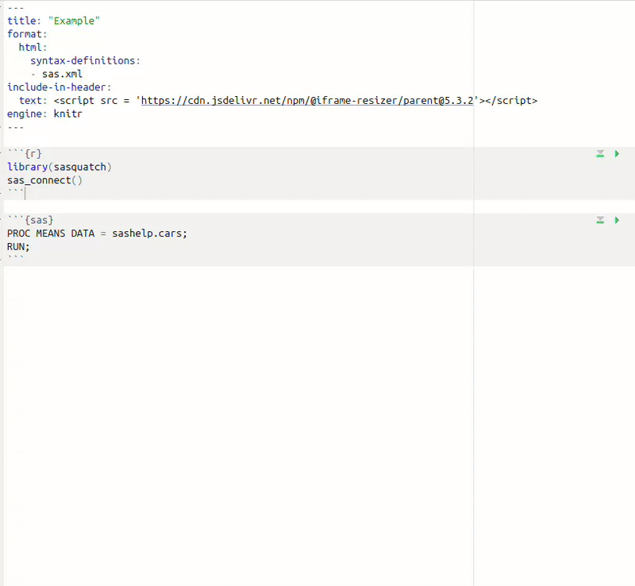

```{r, include = FALSE}
knitr::opts_chunk$set(
  collapse = TRUE,
  comment = "#>"
)
```

```{r, eval = FALSE}
library(sasquatch)
```

## Session management

Every `sasquatch` script starts with `sas_connect()`. By default, you will be
connected to your first SAS configuration (for more about configurations see
`vignette("configuration")`).

```{r, eval = FALSE}
sas_connect()
#> ✔ SAS connection established.
```

You can also specify your configuration by name:

```{r, eval = FALSE}
sas_connect(cfgname = "my_config", reconnect = TRUE)
#> ✔ SAS connection terminated.
#> ✔ SAS connection established.
```

If you ever need to end a connection, you can do so by using:

```{r, eval = FALSE}
sas_disconnect()
#> ✔ SAS connection terminated.
```

All connection information is stored within a `saspy.sasbase.SASsession` object.
For most individuals, you will never need to interact with this object, but if
you would like to implement functionality not currently within `sasquatch` or 
would like to access the current session from Python, you can via:

```{r, eval = FALSE}
sas_get_session()
#> Access Method         = IOM
#> SAS Config name       = my_config
#> SAS Config file       = /home/user/.virtualenvs/r-saspy/lib/python3.12/site-packages/saspy/sascfg_personal.py
#> WORK Path             = /saswork/SAS_work0D3600010B4E_odaws01-usw2-2.oda.sas.com/SAS_work920700010B4E_odaws01-usw2-2.oda.sas.com/
#> SAS Version           = 9.04.01M7P08062020
#> SASPy Version         = 5.101.1
#> Teach me SAS          = False
#> Batch                 = False
#> Results               = Pandas
#> SAS Session Encoding  = utf-8
#> Python Encoding value = utf-8
#> SAS process Pid value = 68430
#> SASsession started    = Wed Dec 25 13:58:22 2024
```

## Executing SAS code

You can execute SAS code in a variety of different ways. All `sas_run_*()` 
functions generate htmlwidgets, which display both the output and log.

To execute a string of SAS code use `sas_run_string()`.

```{r, eval = FALSE}
sas_run_string("PROC MEANS DATA = sashelp.cars;RUN;")
```

```{r, echo = FALSE}
readRDS("files/proc_means_widget.rds")
```

To execute a SAS script use `sas_run_file()`. You can even save the raw SAS HTML 
output and log by specifing an output path for the HTML. 

```{r, eval = FALSE}
cat("PROC MEANS DATA = sashelp.cars;RUN;", file = "script.sas")
sas_widget <- sas_run_file("script.sas")

# will save output.html and output.log files
sas_run_file("script.sas", "output.html")
```

### Within quarto

Quarto documents are a great way to use SAS and R together because they couple
R and SAS within a single reproducable document.

You can create a `sasquatch` quarto document by:

* Specifying the format as html or pdf 
* Specifying the engine as knitr
* Creating an R code block with `library(sasquatch); sas_connect()`

Now, SAS code can be contained within "sas" code blocks.

`````{verbatim}
---
format: html
engine: knitr
---

```{r}
library(sasquatch)
sas_connect()
```

```{sas}
PROC MEANS DATA = sashelp.cars;
RUN;
```
`````

#### RStudio

In RStudio, you will be able to run SAS chunks as you would any other chunk. 



If you want to be able to view SAS output within the Viewer instead of beneath the chunk, you can utilize the `sas_run_selected()` addin. To add a keyboard shortcut for this addin, open Tools -\> Modify Keyboard Shortcuts and search "Run selected in SAS", type in the box under Shortcut to set the keyboard shortcut to your liking and click Apply.


#### Positron

In Positron, you will not be able to run SAS chunks as you would R or Python chunks. However, just as in RStudio, you can create a keyboard shortcut which will allow you to view SAS output within the Plots pane. Open up the command palette with `ctrl+shift+p` or `command+shift+p` and search "Preferences: Open Keyboard Shortcuts (JSON)". Add the following to your shortcuts.

``` json
{
    "key": "ctrl+shift+enter",
    "command": "workbench.action.executeCode.console",
    "when": "editorTextFocus",
    "args": {
        "langId": "r",
        "code": "sasquatch::sas_run_selected()",
        "focus": true
    }
}
```

Edit the `key` argument to set your preferred shortcut.

## Data conversion

R `data.frame`s can be automatically converted to and from SAS tables. However,
`data.frame`s must only contain logical, integer, double, factor, character, 
POSIXct, or Date class columns.

Convert R `data.frame`s to SAS tables with `sas_from_r()`.

```{r, eval = FALSE}
df <- data.frame(
  double = c(1, 2.5, NA),
  integer = c(1:2, NA),
  logical = c(T, F, NA),
  character = c("a", "b", NA),
  factor = factor(c("a", "b", NA)),
  date = as.Date("2015-12-09") + c(1:2, NA),
  datetime = as.POSIXct("2015-12-09 10:51:34.5678", tz = "UTC") + c(1:2, NA)
)
tibble::tibble(df)
#> # A tibble: 3 × 7
#>   double integer logical character factor date       datetime
#>    <dbl>   <int> <lgl>   <chr>     <fct>  <date>     <dttm>
#> 1    1         1 TRUE    a         a      2015-12-10 2015-12-09 10:51:35
#> 2    2.5       2 FALSE   b         b      2015-12-11 2015-12-09 10:51:36
#> 3   NA        NA NA      NA        NA     NA         NA

sas_from_r(df, "df", libref = "WORK")
```

SAS only has two data types (numeric and character). R data types are converted
as follows:

* logical -> numeric
* integer -> numeric
* double -> numeric
* factor -> character
* character -> character
* POSIXct -> numeric (datetime; timezones are lost)
* Date -> numeric (date)


And convert SAS tables back to R `data.frame`s with `sas_to_r()`.

```{r, eval = FALSE}
df <- sas_to_r("df", libref = "WORK")

tibble::tibble(df)
#> # A tibble: 3 × 7
#>   double integer logical character factor date                datetime
#>    <dbl>   <dbl>   <dbl> <chr>     <chr>  <dttm>              <dttm>
#> 1    1         1       1 a         a      2015-12-10 00:00:00 2015-12-09 10:51:35
#> 2    2.5       2       0 b         b      2015-12-11 00:00:00 2015-12-09 10:51:36
#> 3   NA        NA      NA NA        NA     NA                  NA
```

SAS data types are converted as follows:

* numeric -> double
* character -> character
* numeric (datetime; timezones are lost) -> POSIXct
* numeric (date) -> POSIXct

## File management

`sasquatch` offers a few different functions to manage remote SAS files.

Upload files to a remote SAS server with `sas_file_upload()`.

```{r, eval = FALSE}
cat("PROC MEANS DATA = sashelp.cars;RUN;", file = "script.sas")
sas_file_upload(local_path = "script.sas", sas_path = "~/script.sas")
```

Download files from a remote SAS server with `sas_file_download()`.

```{r, eval = FALSE}
sas_file_download(sas_path = "~/script.sas", local_path = "script.sas")
```

Check if a file exists on the remote SAS server with `sas_file_exists()`.

```{r, eval = FALSE}
sas_file_exists("~/script.sas")
```

Copy files on the remote SAS server with `sas_file_copy()`.

```{r, eval = FALSE}
sas_file_copy("~/script.sas", "~/script_copy.sas")
```

Remove files from a remote SAS server with `sas_file_remove()`.

```{r, eval = FALSE}
sas_file_remove("~/script_copy.sas")
```

List all files and directories within a remote SAS server with `sas_list()`.

```{r, eval = FALSE}
sas_list("~")
#> [1] "directory1" "file1.csv" "file2.sas"
```